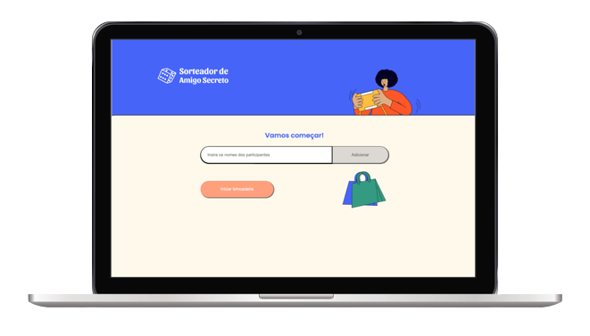

#  Secret Friend Game &middot;    

<div align="center">
  
</div>

<br/>


## 💡 Introduction
Web application - Secret Friend game created by using TDD method with Jest and React
1. User can type friends names and start the game
2. On sortition page user can select friends names and see each ones partner's names on submit


<br/>

## 🖥 Pre-requisites:

- NodeJS

<br/>

## 💾 How to Install Dependencies?

### Using NPM:

```
  npm install
```

### Using Yarn:

```
  yarn
```

<br/>

## 🚀 How to Run it?

### Using NPM:

```
  npm start
```

### Using Yarn:

```
  yarn start
```

<br/>

## © License

MIT License © Yuri Paiva